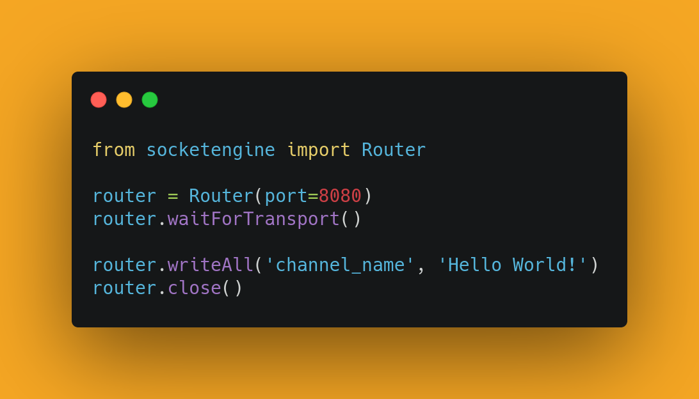
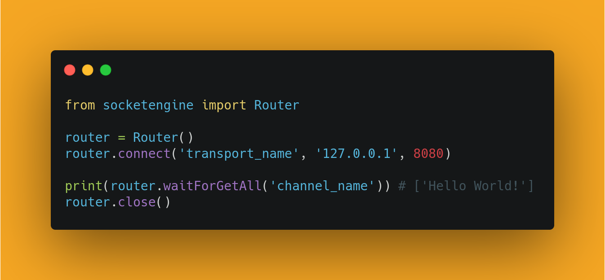

# socket.engine

## Installation

Python:

```
pip install socket.engine
```

This library requires Python3. It was tested extensively on Python 3.7.5 with Ubuntu 19.04.

## How to use

<div align="center">
  
</div>

<div align="center">
  
</div>

## Documentation — Router

#### Router Constructor

```
Router(port, timeout, size)
	port = (Optional) (Number) Port Transport to use with socket
	timeout = (Optional) (Number) Sets the standard timeout of a socket (in seconds)
	size = (Optional) (Number) Default read size of socket
```

#### Opening Connections

```
Router.connect(name, addr, port)
	name = (Required) (String)
	addr = (Required) (String)
	port = (Required) (Number)
	Connects to a remote Router or Transport object, and names the connection. This is a BLOCKING action until the connection is made.
```

#### Standard Interface

```
Router.close()
	Closes the Router and all associated Transport objects (both local and remote)

Router.getConnections()
	Returns a list of all Transport objects currently controlled by the Router

Router.waitForTransport()
	If no Transports exist, blocks until a Transport has been opened and connected. Otherwise blocks until any current Transport connections are done forming (note: does not wait for Transport operations to finish other than opening the connection)

Router.canWriteAll()
	Returns True if all Transport objects and write, False otherwise

Router.getAll(channel)
	channel = (Required) (String)
	Returns a list of all data received over the specified channel from all Transports. Returns an empty list if no data exists.

Router.getImageAll()
	Returns a list of all images received by Transports. Returns an empty list if no data exists.

Router.getByName(name, channel)
	name = (Required) (String)
	Returns a list of all data received over a specified channel of Transports with the same name. Returns an empty list if no data exists.

Router.getLocal(channel)
	channel = (Required) (String)
	Returns a list of all data received over a specified channel by Transports initiated by the Router. Returns an empty list if no data exists.

Router.getRemote(channel)
	channel = (Required) (String)
	Returns a list of all data received over a specified channel by Transports initiated by a remote Router. Returns an empty list if no data exists.

Router.writeAll(channel, data)
	channel = (Required) (String)
	data = (Required) (String)
	Writes the specified string to all connected Transports on the specified channel.

Router.writeToName(name, channel, data)
	name = (Required) (String)
	channel = (Required) (String)
	data = (Required) (String)
	Writes the specified string to all connected Transports on the specified channel if the Transport name matches.

Router.writeToLocal(channel, data)
	channel = (Required) (String)
	data = (Required) (String)
	Writes the specified string to all locally initiated Transports on the specified channel.

Router.writeToRemote(channel, data)
	channel = (Required) (String)
	data = (Required) (String)
	Writes the specified string to all remotely initiated Transports on the specified channel.

Router.writeImageAll(data)
	data = (Required) (Numpy Image)
	Writes the given image to all connected Transports.

Router.writeImageToName(name, data)
	name = (Required) (String)
	data = (Required) (Numpy Image)
	Writes the given image to all Transports with the specified name.

Router.writeImageToLocal(data)
	data = (Required) (Numpy Image)
	Writes the given image to all Transports initiated locally.

Router.writeImageToRemote(data)
	data = (Required) (Numpy Image)
	Writes the given image to all Transports initiated remotely.
```

#### Synchronous Interface

NOTE: These are all blocking actions until they complete.
```
Router.writeAllWhenReady(channel, data)
	channel = (Required) (String)
	data = (Required) (String)
	Will block until all Transports are able to write, and then writes to all Transports on the specified channel with the specified data.

Router.writeToNameWhenReady(name, channel, data)
	name = (Required) (String)
	channel = (Required) (String)
	data = (Required) (String)
	Will block until all Transports with the specified name are able to write, and then write to the Transports on the specified channel with the specified data.

Router.waitForGetAll(channel)
	channel = (Required) (String)
	Will block until all Transports have data on the specified channel, then return an array with the data from each Transport.

Router.waitForAllReady()
	Will block until all Transports are ready (see Transport documentation for more details. This function invokes Transport.waitForReady())
```
