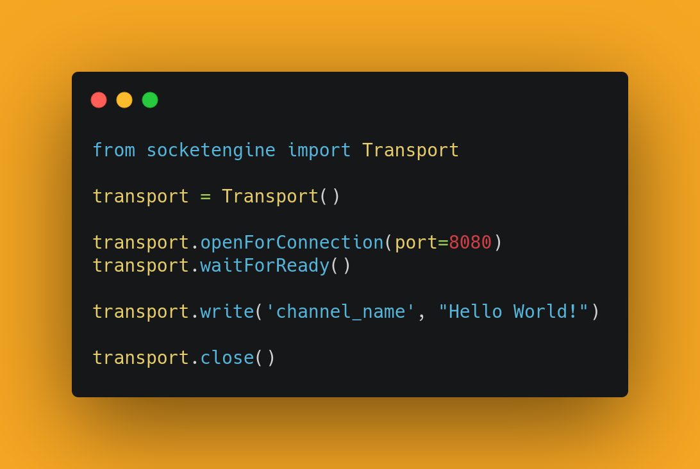
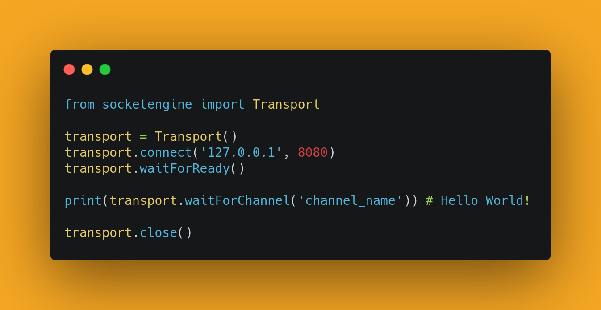

# socket.engine

## Installation

Python:

```
pip install socket.engine
```

This library requires Python3. It was tested extensively on Python 3.7.5 with Ubuntu 19.04.

## How to use

<div align="center">
  
</div>

<div align="center">
  
</div>

## Documentation — Transport

#### Transport Constructor:

```
Transport(name, timeout, size, useCompression, requireAck, enableBuffer)
	name = (Optional) (String) Names the socket connection
	timeout = (Optional) (Number) Sets the standard timeout of the socket (in seconds)
	size = (Optional) (Number) Sets the default read size of the socket
	useCompression = (Optional) (Boolean) Determines is compression is used on the socket (default False)
	requireAck = (Optional) (Boolean) Determines if each message requires confirmation once received (default False)
	enableBuffer = (Optional) (Boolean) Determines if messages can be buffered and sent at some point later
```

#### Opening Connections

```
Transport.openForConnection(port)
	port = (Required) (Number)
	Opens the specified port for incoming connections. Only a single connection is allowed per Transport. This is a BLOCKING action until a connection is made.

Transport.connect(addr, port)
	addr = (Required) (String) The IP address of a remote Transport
	port = (Required) (Number) The port on the remote Transport
	Connects to a remote Transport. Only a single connection is allowed per Transport. This is a BLOCKING action until a connection is made.
```

#### Standard Interface

```
Transport.assignName(name)
	name = (Required) (String) Names the connection, and sends the name to the remote Transport to set it.

Transport.get(channel)
	channel = (Required) (String) Gets the most recent piece of data sent over the specified channel. Returns None if no data exists on the channel.

Transport.getImage()
	Gets the most recent image sent to the socket. Returns None if one has not been received.

Transport.canWrite():
	Returns a boolean if the socket is able to write a new message. Always returns True if the enableBuffer configuration is True

Transport.write(channel, data, requireAck=False)
	channel = (Required) (String)
	data = (Required) (String)
	Sends the specified data over the channel to the remote Transport. If the requireAck flag is set to true, the socket will block until the message is acknowledged by the remote Transport.

Transport.writeImage(data, requireAck=False)
	data = (Required) (Numpy Image)
	Sends the given image to the remote socket. If the requireAck flag is set to true, the socket will block until the image is acknowledged by the remote Transport.

Transport.close()
	Closes the Transport. Will also close the remote Transport (provided it has not been closed first). Once a Transport is closed, it CANNOT be reopened.

Transport.registerCallback(channel, function):
	channel = (Required) (String)
	function = (Required) arguments: (Transport, channel, data)
	Registers a callback function to be called whenever new information is received over a channel. The function must take the arguments of the Transport object, the name of the channel, and the new data received.
```

#### Synchronous Interface

NOTE: These are all blocking actions until they complete.
```
Transport.waitForReady()
	Will block until the Transport is fully setup and able to write. Will return immediately if the Transport enableBuffer option is True. (This function is the conjunction of waitForOpen and canWrite.)

Transport.waitForClose()
	Will block until the Transport has succesfully closed. If the close function has not been called, this will block until the remote Transport sends a close message.

Transport.waitForOpen()
	Will block until the Transport is opened.

Transport.waitForName()
	Will block until the Transport has a name assigned (either locally or from the remote Transport).

Transport.waitForChannel(channel)
	channel = (Required) (String)
	Will block until data is received on the specified channel. Other data may be recieved on different channels while waiting for this to become true.

Transport.waitForImage()
	Will block until an image is received. Other data may be recieved on different channels while waiting for this to become true.

Transport.writeSync(channel, data):
	channel = (Required) (String)
	data = (Required) (String)
	Has the same functionality as write(channel, data, requireAck=True), and will block until the acknowledgement has been received.

Transport.writeImageSync(channel, data):
	channel = (Required) (String)
	data = (Required) (String)
	Has the same functionality as writeImage(data, requireAck=True), and will block until the acknowledgement has been received.
```
